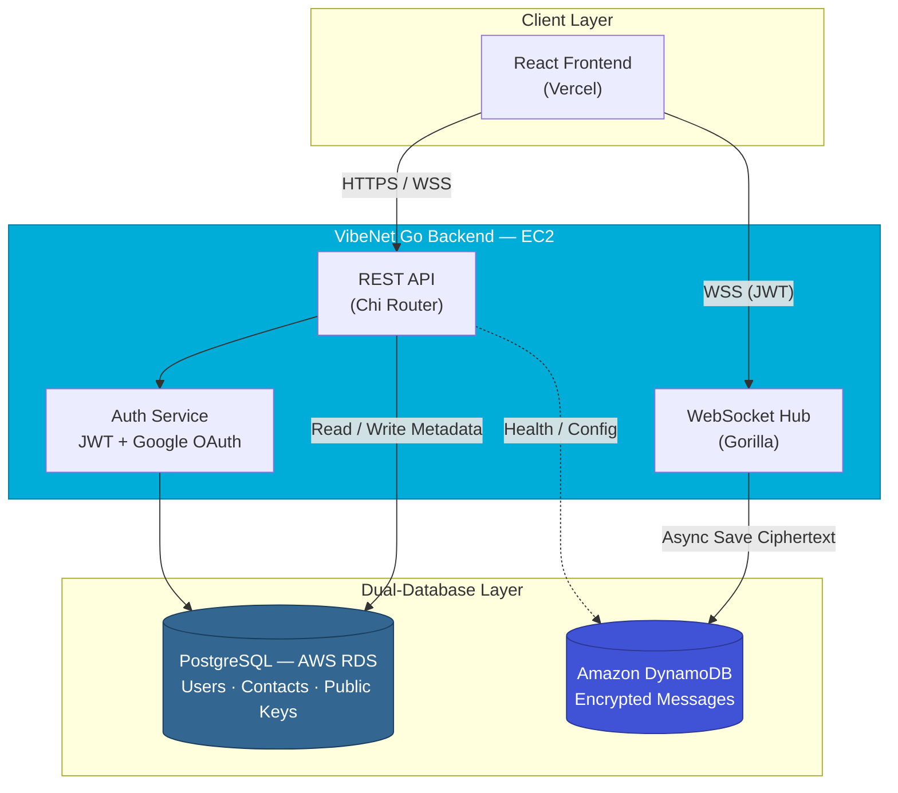
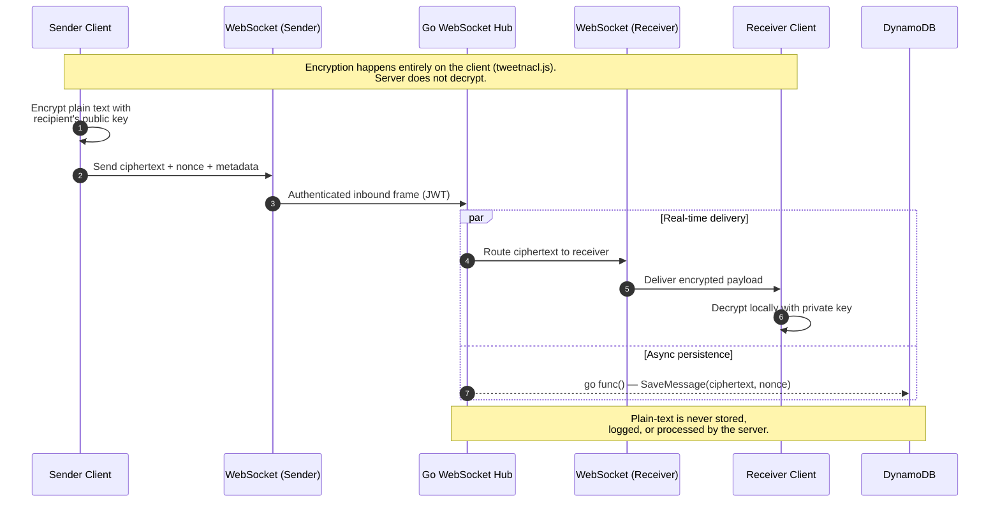

<div align="center">

# VibeNet Backend — Secure Real-Time Chat API

[](https://go.dev/)
[](LICENSE)
[](https://github.com/ChamathDilshanC/VibeNet-backend/actions)
[](https://www.postgresql.org/)
[](https://aws.amazon.com/dynamodb/)
[](https://github.com/gorilla/websocket)

**Blind-router backend for a scalable, end-to-end encrypted real-time chat platform.**

[Features](#key-features) · [Architecture](#architecture--visualizations) · [API Reference](#api-reference) · [Local Setup](#local-setup--installation) · [Project Structure](#project-structure)

</div>

---

## Project Overview

**VibeNet Backend** is the Go-powered API and WebSocket server behind [VibeNet](https://github.com/ChamathDilshanC/VibeNet-backend) — a highly scalable, WhatsApp-style chat application with **End-to-End Encryption (E2EE)**. The server acts as a **blind router**: it authenticates users, stores encrypted payloads, and relays ciphertext in real time — but **never decrypts, inspects, or logs plain-text messages**.

Built for the AWS Free Tier (EC2, RDS, DynamoDB), the backend separates relational metadata from high-volume message traffic using a deliberate **dual-database strategy**, keeping reads fast and writes durable at scale.

---

## Architecture & Visualizations

### Diagram A — Dual-Database Architecture

The REST API and WebSocket hub coordinate two purpose-built data stores: PostgreSQL for structured user metadata, and DynamoDB for write-heavy encrypted chat history.



> **Design principle:** PostgreSQL owns infrequently updated, relational data. DynamoDB absorbs the high-frequency write load of encrypted messages without bloating the relational schema.

---

### Diagram B — E2EE WebSocket Message Flow

Encrypted messages travel through the hub in real time while persistence happens concurrently — the server never sees decrypted content.



> **Security note:** The Go backend is intentionally dumb about message content. It routes opaque ciphertext blobs and cryptographic metadata (`nonce`) only.

---

## Key Features

- **End-to-End Encryption (E2EE)** — Clients encrypt and decrypt locally; the server stores and forwards ciphertext exclusively.
- **Google OAuth 2.0** — One-click sign-in with automatic user provisioning and deferred public-key upload.
- **JWT Authentication** — Stateless bearer tokens secure REST endpoints and WebSocket upgrades.
- **Dual-Database Strategy** — PostgreSQL (RDS) for users, contacts, and public keys; DynamoDB for encrypted message history.
- **Anti-Spam Rotating PIN** — Users can mandate a 4-digit PIN (valid for 5 mins) required by strangers to initiate a chat.
- **Concurrent WebSocket Routing** — Hub-based connection pooling with non-blocking `go func()` writes to DynamoDB alongside real-time delivery.
- **Production-Ready Stack** — Chi router, CORS, bcrypt password hashing, GORM, and AWS SDK v2.

---

## API Reference

### REST Endpoints

| Method | Endpoint | Auth | Description |
|--------|----------|------|-------------|
| `GET` | `/health` | — | Health check — returns `ok` |
| `POST` | `/api/auth/register` | — | Register with `username`, `password`, and E2EE `public_key` |
| `POST` | `/api/auth/login` | — | Standard login — returns a signed JWT |
| `GET` | `/api/auth/google/login` | — | Redirects to the Google OAuth consent screen |
| `GET` | `/api/auth/google/callback` | — | Handles the OAuth callback and returns a JWT |
| `PUT` | `/api/user/public-key` | JWT | Upload or update the authenticated user's E2EE public key |
| `PUT` | `/api/user/settings/pin-toggle` | JWT | Enable/disable the anti-spam chat PIN — body `{ "require_pin": true }` |
| `GET` | `/api/user/my-pin` | JWT | Return the caller's active 4-digit PIN (auto-refreshed if missing/expired) |
| `GET` | `/api/users/search?username={uname}` | JWT | Search users by username; returns `user_id`, `username`, `require_pin` (never the PIN) |
| `GET` | `/api/users/{id}/key?pin={pin}` | JWT | Fetch a user's public key; `pin` required when the target mandates a chat PIN |

### WebSocket

| Method | Endpoint | Auth | Description |
|--------|----------|------|-------------|
| `GET` | `/ws?token=<jwt>` | JWT | Upgrade to WebSocket; send and receive encrypted message frames |

**Inbound WebSocket frame (client → server):**

```json
{
  "message_id": "uuid",
  "receiver_id": "uuid",
  "chat_room_id": "sender-receiver-pair",
  "ciphertext": "base64-or-encoded-ciphertext",
  "nonce": "initialization-vector",
  "timestamp": 1710000000000
}
```

---

## Local Setup & Installation

### Prerequisites

- [Go 1.25+](https://go.dev/dl/)
- PostgreSQL instance (local or AWS RDS)
- Amazon DynamoDB table (or [DynamoDB Local](https://docs.aws.amazon.com/amazondynamodb/latest/developerguide/DynamoDBLocal.html))
- Google OAuth credentials (for social login)

### Steps

**1. Clone the repository**

```bash
git clone https://github.com/ChamathDilshanC/VibeNet-backend.git
cd VibeNet-backend
```

**2. Configure environment variables**

```bash
cp .env.example .env
```

Edit `.env` with your credentials. At minimum, set:

| Variable | Purpose |
|----------|---------|
| `POSTGRES_*` | PostgreSQL / RDS connection |
| `AWS_REGION`, `DYNAMODB_MESSAGES_TABLE` | DynamoDB configuration |
| `JWT_SECRET` | Token signing secret |
| `GOOGLE_CLIENT_ID`, `GOOGLE_CLIENT_SECRET`, `GOOGLE_REDIRECT_URL` | OAuth 2.0 |
| `CORS_ALLOWED_ORIGINS` | Allowed frontend origins |

> **Tip:** For local DynamoDB, uncomment `DYNAMODB_ENDPOINT=http://localhost:8000` in `.env`.

**3. Run the server**

```bash
go run ./cmd/api
```

The API starts on `http://localhost:8080` (configurable via `APP_PORT`).

```bash
curl http://localhost:8080/health
# ok
```

---

## Project Structure

```
VibeNet-backend/
├── cmd/
│   └── api/
│       └── main.go              # Application entry point — wires DBs, routes, and server
├── internal/
│   ├── api/                     # REST handlers, JWT middleware, Google OAuth routes
│   ├── auth/                    # JWT manager and Google userinfo helpers
│   ├── db/                      # PostgreSQL & DynamoDB connection pools and repositories
│   ├── models/                  # GORM and DynamoDB data models (User, Contact, Message)
│   └── websocket/               # Hub, Client, and WebSocket upgrade handler
├── pkg/
│   └── utils/                   # Shared helpers (environment variable loading)
├── .env.example                 # Environment variable template
├── go.mod
└── go.sum
```

| Directory | Responsibility |
|-----------|----------------|
| `cmd/` | Thin executables — bootstrap and run the application |
| `internal/` | Private application code not intended for external import |
| `pkg/` | Reusable utilities safe for cross-package use |

---

## Authorship

Developed by **Chamath Dilshan** ([@ChamathDilshanC](https://github.com/ChamathDilshanC))
