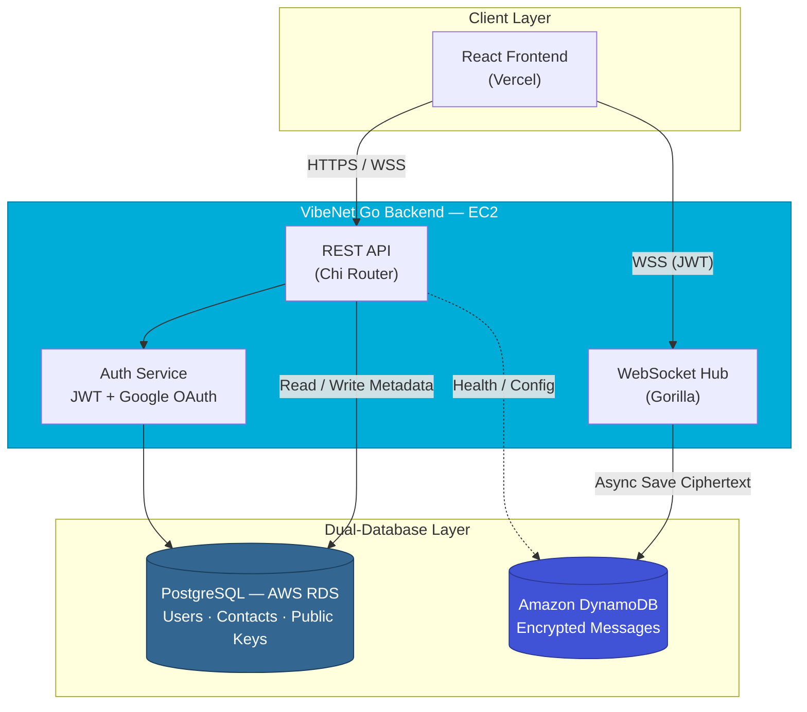
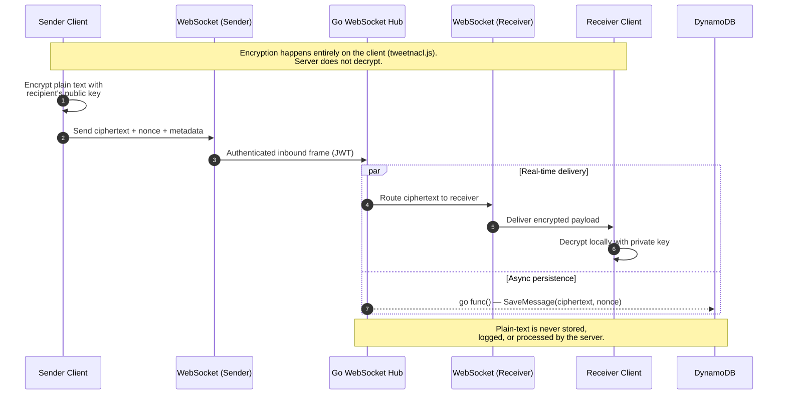
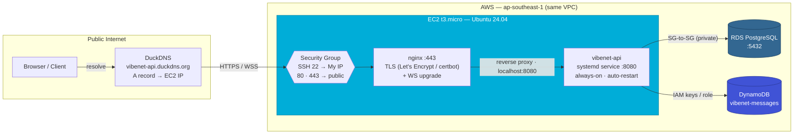
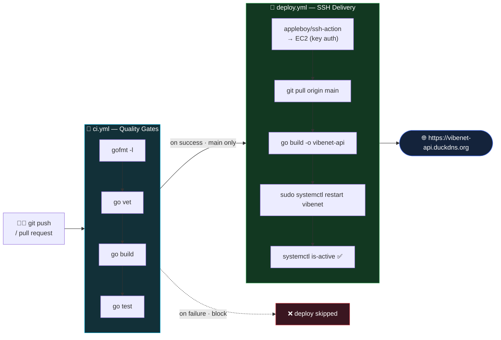

<div align="center">

# VibeNet Backend — Secure Real-Time Chat API

[](https://go.dev/)
[](LICENSE)
[](https://github.com/ChamathDilshanC/VibeNet-backend/actions)
[](https://www.postgresql.org/)
[](https://aws.amazon.com/dynamodb/)
[](https://github.com/gorilla/websocket)

**Blind-router backend for a scalable, end-to-end encrypted real-time chat platform.**

[Features](#key-features) · [Architecture](#architecture--visualizations) · [API Reference](#api-reference) · [Local Setup](#local-setup--installation) · [Deployment](#deployment) · [CI/CD](#cicd-pipeline) · [Project Structure](#project-structure)

</div>

---

## Project Overview

**VibeNet Backend** is the Go-powered API and WebSocket server behind [VibeNet](https://github.com/ChamathDilshanC/VibeNet-backend) — a highly scalable, WhatsApp-style chat application with **End-to-End Encryption (E2EE)**. The server acts as a **blind router**: it authenticates users, stores encrypted payloads, and relays ciphertext in real time — but **never decrypts, inspects, or logs plain-text messages**.

Built for the AWS Free Tier (EC2, RDS, DynamoDB), the backend separates relational metadata from high-volume message traffic using a deliberate **dual-database strategy**, keeping reads fast and writes durable at scale.

---

## Architecture & Visualizations

### Diagram A — Dual-Database Architecture

The REST API and WebSocket hub coordinate two purpose-built data stores: PostgreSQL for structured user metadata, and DynamoDB for write-heavy encrypted chat history.



> **Design principle:** PostgreSQL owns infrequently updated, relational data. DynamoDB absorbs the high-frequency write load of encrypted messages without bloating the relational schema.

---

### Diagram B — E2EE WebSocket Message Flow

Encrypted messages travel through the hub in real time while persistence happens concurrently — the server never sees decrypted content.



> **Security note:** The Go backend is intentionally dumb about message content. It routes opaque ciphertext blobs and cryptographic metadata (`nonce`) only.

---

## Key Features

- **End-to-End Encryption (E2EE)** — Clients encrypt and decrypt locally; the server stores and forwards ciphertext exclusively.
- **Google OAuth 2.0** — One-click sign-in with automatic user provisioning and deferred public-key upload.
- **JWT Authentication** — Stateless bearer tokens secure REST endpoints and WebSocket upgrades.
- **Dual-Database Strategy** — PostgreSQL (RDS) for users, contacts, and public keys; DynamoDB for encrypted message history.
- **Anti-Spam Rotating PIN** — Users can mandate a 4-digit PIN (valid for 5 mins) required by strangers to initiate a chat.
- **Concurrent WebSocket Routing** — Hub-based connection pooling with non-blocking `go func()` writes to DynamoDB alongside real-time delivery.
- **Production-Ready Stack** — Chi router, CORS, bcrypt password hashing, GORM, and AWS SDK v2.

---

## API Reference

### REST Endpoints

| Method | Endpoint | Auth | Description |
|--------|----------|------|-------------|
| `GET` | `/health` | — | Deep health check — pings PostgreSQL & DynamoDB, returns per-service status, latency, and uptime ([details](#health-check)) |
| `POST` | `/api/auth/register` | — | Register with `username`, `password`, and E2EE `public_key` |
| `POST` | `/api/auth/login` | — | Standard login — returns a signed JWT |
| `GET` | `/api/auth/google/login` | — | Redirects to the Google OAuth consent screen |
| `GET` | `/api/auth/google/callback` | — | Handles the OAuth callback and returns a JWT |
| `PUT` | `/api/user/public-key` | JWT | Upload or update the authenticated user's E2EE public key |
| `PUT` | `/api/user/settings/pin-toggle` | JWT | Enable/disable the anti-spam chat PIN — body `{ "require_pin": true }` |
| `GET` | `/api/user/my-pin` | JWT | Return the caller's active 4-digit PIN (auto-refreshed if missing/expired) |
| `GET` | `/api/users/search?username={uname}` | JWT | Search users by username; returns `user_id`, `username`, `require_pin` (never the PIN) |
| `GET` | `/api/users/{id}/key?pin={pin}` | JWT | Fetch a user's public key; `pin` required when the target mandates a chat PIN |

### Health Check

`GET /health` is a **deep** liveness/readiness probe. On every request it opens a 3-second
context and actively pings both data stores in parallel with their individual round-trip
latency, so it reflects live connectivity rather than a static "the process is up" flag.
The JSON body is pretty-printed by default.

**Response — all healthy (`200 OK`):**

```json
{
  "status": "ok",
  "service": "vibenet-backend",
  "version": "1.0.0",
  "environment": "development",
  "timestamp": "2026-07-08T08:27:31Z",
  "uptime_seconds": 142,
  "services": {
    "postgres": { "status": "up", "latency_ms": 18 },
    "dynamodb": { "status": "up", "latency_ms": 42 }
  }
}
```

**Response — a dependency is down (`503 Service Unavailable`):**

```json
{
  "status": "degraded",
  "service": "vibenet-backend",
  "version": "1.0.0",
  "environment": "development",
  "timestamp": "2026-07-08T08:27:31Z",
  "uptime_seconds": 142,
  "services": {
    "postgres": { "status": "down", "latency_ms": 3001, "error": "ping postgres: context deadline exceeded" },
    "dynamodb": { "status": "up", "latency_ms": 40 }
  }
}
```

| Field | Description |
|-------|-------------|
| `status` | `ok` when every dependency is reachable, else `degraded` |
| `service` / `version` / `environment` | Service identity; `version` is overridable via `APP_VERSION`, `environment` via `APP_ENV` |
| `timestamp` | Server time in UTC (RFC 3339) |
| `uptime_seconds` | Seconds since the process started |
| `services.<name>.status` | `up` or `down` for each dependency |
| `services.<name>.latency_ms` | Ping round-trip time in milliseconds |
| `services.<name>.error` | Present only when that dependency is `down` |

**HTTP status codes:** `200` when healthy, `503` when any dependency is down — so load
balancers, Kubernetes probes, and uptime monitors can gate traffic on the status code alone.

> ⚠️ **Production note:** the `error` field can expose internal details (host names, driver
> messages). If you expose `/health` publicly, set `APP_ENV=production` and consider stripping
> the `error` field or placing the endpoint behind authentication.

```bash
# Quick check
curl -s http://localhost:8080/health | jq
```

### WebSocket

| Method | Endpoint | Auth | Description |
|--------|----------|------|-------------|
| `GET` | `/ws?token=<jwt>` | JWT | Upgrade to WebSocket; send and receive encrypted message frames |

**Inbound WebSocket frame (client → server):**

```json
{
  "message_id": "uuid",
  "receiver_id": "uuid",
  "chat_room_id": "sender-receiver-pair",
  "ciphertext": "base64-or-encoded-ciphertext",
  "nonce": "initialization-vector",
  "timestamp": 1710000000000
}
```

---

## Local Setup & Installation

### Prerequisites

- [Go 1.25+](https://go.dev/dl/)
- PostgreSQL instance (local or AWS RDS)
- Amazon DynamoDB table (or [DynamoDB Local](https://docs.aws.amazon.com/amazondynamodb/latest/developerguide/DynamoDBLocal.html))
- Google OAuth credentials (for social login)

### Steps

**1. Clone the repository**

```bash
git clone https://github.com/ChamathDilshanC/VibeNet-backend.git
cd VibeNet-backend
```

**2. Configure environment variables**

```bash
cp .env.example .env
```

Edit `.env` with your credentials. At minimum, set:

| Variable | Purpose |
|----------|---------|
| `POSTGRES_*` | PostgreSQL / RDS connection |
| `AWS_REGION`, `DYNAMODB_MESSAGES_TABLE` | DynamoDB configuration |
| `JWT_SECRET` | Token signing secret |
| `GOOGLE_CLIENT_ID`, `GOOGLE_CLIENT_SECRET`, `GOOGLE_REDIRECT_URL` | OAuth 2.0 |
| `CORS_ALLOWED_ORIGINS` | Allowed frontend origins — **comma-separated** for multiple (e.g. `http://localhost:5173,https://vibenet.app`) |
| `APP_ENV`, `APP_VERSION` | Environment label and version string surfaced by `/health` (optional) |

> **Tip:** For local DynamoDB, uncomment `DYNAMODB_ENDPOINT=http://localhost:8000` in `.env`.

**3. Run the server**

```bash
go run ./cmd/api
```

The API starts on `http://localhost:8080` (configurable via `APP_PORT`).

```bash
curl -s http://localhost:8080/health | jq
# {
#   "status": "ok",
#   "service": "vibenet-backend",
#   "services": {
#     "postgres": { "status": "up", "latency_ms": 4 },
#     "dynamodb": { "status": "up", "latency_ms": 12 }
#   }
# }
```

A `status: ok` with both services `up` confirms PostgreSQL and DynamoDB are reachable. See [Health Check](#health-check) for the full response schema.

---

## Deployment

The backend is designed for the **AWS Free Tier**. Because it holds long-lived **WebSocket**
connections for real-time chat, it needs an **always-on** host — an **EC2 `t3.micro`** instance
(free for 12 months) is the recommended target, living in the same VPC as RDS and DynamoDB.

> **Live endpoint:** the reference deployment runs at **`https://vibenet-api.duckdns.org`** — a free [DuckDNS](https://www.duckdns.org) subdomain pointed at the EC2 public IP, fronted by nginx with a Let's Encrypt certificate.

### Diagram C — Production Topology (AWS EC2)



### Live Deployment Walkthrough

The sequence below reflects the **exact path** used to take this backend from a blank EC2 instance to a public HTTPS endpoint. The numbered guides in [`docs/`](docs/) expand every stage.

```mermaid
flowchart LR
    S1["1 · Launch EC2<br/>t3.micro · Ubuntu"]
    S2["2 · Security Group<br/>SSH · 80 · 443"]
    S3["3 · SSH + go build<br/><i>2G swap for OOM</i>"]
    S4["4 · .env<br/>prod secrets"]
    S5["5 · RDS SG-to-SG"]
    S6["6 · systemd<br/>always-on"]
    S7["7 · DuckDNS + nginx<br/>+ certbot · HTTPS 🔒"]

    S1 --> S2 --> S3 --> S4 --> S5 --> S6 --> S7

    style S1 fill:#20344a,color:#fff,stroke:#61DAFB
    style S2 fill:#20344a,color:#fff,stroke:#61DAFB
    style S3 fill:#123038,color:#fff,stroke:#00ADD8
    style S4 fill:#123038,color:#fff,stroke:#00ADD8
    style S5 fill:#14233b,color:#fff,stroke:#4169E1
    style S6 fill:#1e1b2e,color:#fff,stroke:#6E56CF
    style S7 fill:#123821,color:#fff,stroke:#2EA44F
```



| # | Stage | What happens | Result |
|---|-------|--------------|--------|
| **1** | **EC2 launch** | `t3.micro` (free tier), Ubuntu 24.04, RSA `.pem` key | Always-on host + public IP |
| **2** | **Security group** | SSH `22` → *My IP*; HTTP `80` + HTTPS `443` → public; `8080` closed after HTTPS is live | Locked-down inbound surface |
| **3** | **Build** | `apt` Go + git, `go build ./cmd/api`; **2 GB swap** added so the compiler survives the OOM on 1 GB RAM | `vibenet-api` binary |
| **4** | **Config** | Production `.env` — fresh `JWT_SECRET`, RDS creds, IAM keys, `APP_ENV=production` | Runtime configured |
| **5** | **RDS connectivity** | Security-group-to-security-group rule (EC2 SG → RDS SG, port `5432`) | DB reachable privately, never public |
| **6** | **systemd service** | `vibenet.service` — `Restart=always`, `EnvironmentFile=.env`, enabled on boot | 24/7 auto-healing backend |
| **7** | **Domain + HTTPS** | Free **DuckDNS** subdomain → EC2 IP; **nginx** reverse proxy + **Let's Encrypt** (certbot) with auto-renewal & WebSocket upgrade headers | `https://vibenet-api.duckdns.org` 🔒 |

> **Verify end-to-end:** `curl -s https://vibenet-api.duckdns.org/health | jq` should return `status: ok` with both `postgres` and `dynamodb` reporting `up`.

### Step-by-Step Guides

Full, beginner-friendly walkthroughs — launch to HTTPS — are in [`docs/`](docs/):

| Guide | Language |
|-------|----------|
| [EC2 Deployment Guide](docs/DEPLOYMENT.md) | 🌐 English |
| [EC2 Deployment Guide](docs/DEPLOYMENT.si.md) | 🇱🇰 සිංහල |

They cover launching the instance, security groups, SSH, building the binary, the `.env`,
EC2→RDS connectivity, running as a `systemd` service, optional nginx + TLS, health verification,
and free-tier cost notes.

> ⚠️ **Not Vercel/serverless:** persistent WebSocket connections rule out serverless
> functions. Use an always-on host — AWS EC2/Lightsail, or platforms like Render/Railway/Fly.io.

### Cloud Resource Setup

Provisioning RDS, DynamoDB, IAM, JWT, and Google OAuth from scratch is documented in the
repo-root [`AWS_SETUP_GUIDE.md`](../AWS_SETUP_GUIDE.md).

---

## CI/CD Pipeline

Two [GitHub Actions](.github/workflows/) workflows automate quality gates and delivery. A broken
build **never** reaches the server — the deploy job runs only after CI succeeds on `main`.

### Diagram D — Automated Build → Deploy Flow



### Workflows

| Workflow | Trigger | Steps | Purpose |
|----------|---------|-------|---------|
| [`ci.yml`](.github/workflows/ci.yml) | push & PR to `main` | `gofmt` → `go vet` → `go build` → `go test` | Fail fast on formatting, static, or compile errors |
| [`deploy.yml`](.github/workflows/deploy.yml) | `workflow_run` after CI **succeeds** on `main` | SSH → `git pull` → `go build` → `systemctl restart` → health-gate | Zero-touch delivery to the EC2 host |

### Required Repository Secrets

Configure under **Settings → Secrets and variables → Actions**:

| Secret | Value | Notes |
|--------|-------|-------|
| `EC2_HOST` | `vibenet-api.duckdns.org` | Stable DuckDNS name — survives EC2 IP changes |
| `EC2_USER` | `ubuntu` | Default Ubuntu AMI login |
| `EC2_SSH_KEY` | contents of `vibenet-key.pem` | Full PEM incl. `BEGIN`/`END` lines — key-only auth |

> [!NOTE]
> The deploy job SSHes in from GitHub's runners, so the EC2 security group must allow inbound
> SSH (`22`) from those dynamic IPs. Password auth is disabled server-side
> (`PasswordAuthentication no`), so access stays **key-only**.

---

## Project Structure

```
VibeNet-backend/
├── cmd/
│   └── api/
│       └── main.go              # Application entry point — wires DBs, routes, and server
├── internal/
│   ├── api/                     # REST handlers, JWT middleware, Google OAuth routes
│   ├── auth/                    # JWT manager and Google userinfo helpers
│   ├── db/                      # PostgreSQL & DynamoDB connection pools and repositories
│   ├── models/                  # GORM and DynamoDB data models (User, Contact, Message)
│   └── websocket/               # Hub, Client, and WebSocket upgrade handler
├── pkg/
│   └── utils/                   # Shared helpers (environment variable loading)
├── docs/
│   ├── DEPLOYMENT.md            # AWS EC2 deployment guide (English)
│   └── DEPLOYMENT.si.md         # AWS EC2 deployment guide (සිංහල)
├── .env.example                 # Environment variable template
├── go.mod
└── go.sum
```

| Directory | Responsibility |
|-----------|----------------|
| `cmd/` | Thin executables — bootstrap and run the application |
| `internal/` | Private application code not intended for external import |
| `pkg/` | Reusable utilities safe for cross-package use |

---

## Authorship

Developed by **Chamath Dilshan** ([@ChamathDilshanC](https://github.com/ChamathDilshanC))
